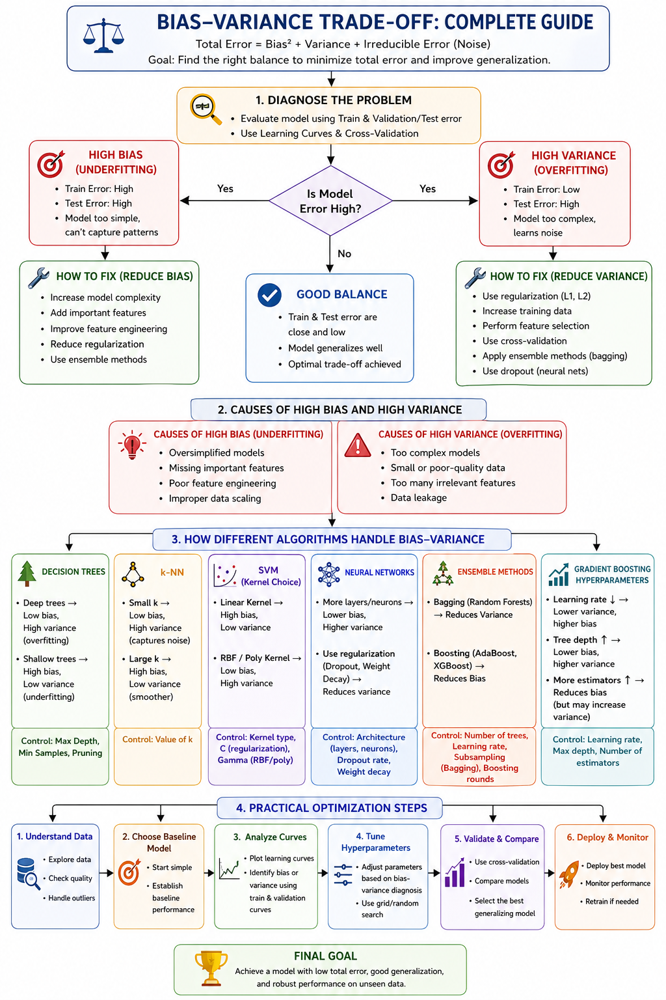

# Bias-variance-tradeoff-ml

# Bias, Variance & Error

Bias and variance are the two main sources of error in machine learning. Bias happens when a model is too simple and cannot capture the real patterns in data (underfitting). Variance happens when a model is too complex and learns noise instead of actual patterns (overfitting). The total prediction error comes from three parts: bias², variance, and irreducible error (noise in data). 

The key idea is the bias-variance tradeoff—if you reduce bias, variance usually increases, and vice versa. The goal is to find the right balance where total error is minimum. This is why it is impossible to completely minimize both at the same time.

# High Bias vs High Variance- Model Behavior

A high-bias model is too simple. It performs poorly on both training and test data because it cannot learn patterns properly. Examples include using linear models for complex data.

A high-variance model is too complex. It performs very well on training data but poorly on test data because it memorizes instead of learning. This is common in deep trees or overly complex models. 

The difference can be identified using errors:

•	High bias → training error ≈ test error (both high) 

•	High variance → training error low, test error high 

# Causes of High Bias and High Variance

High variance (overfitting) usually happens due to:

•	Too complex models 

•	Small or poor-quality data 

•	Too many irrelevant features

•	Data leakage 

High bias (underfitting) happens due to:

•	Oversimplified models 

•	Missing important features

•	Poor feature engineering 

•	Improper data scaling 

Model complexity directly affects bias and variance. Simple models (low complexity) have high bias and low variance. Complex models have low bias but high variance.
As complexity increases:
•	Bias decreases 

•	Variance increases 

# Diagnosing Bias & Variance
Bias and variance issues can be identified using:

•	Learning curves

•	Validation curves 

•	Cross-validation 

Patterns:

•	High bias → training & validation scores both low 

•	High variance → training high, validation low 

Cross-validation helps estimate how well the model generalizes to unseen data. 

# Techniques to Reduce Bias

To reduce bias (underfitting), we:

•	Increase model complexity 

•	Add more useful features 

•	Use better feature engineering 

•	Use ensemble methods 

The goal is to allow the model to capture more patterns in data. 

# Techniques to Reduce Variance

To reduce variance (overfitting), we:

•	Use regularization (L1, L2) 

•	Apply cross-validation 

•	Do feature selection 

•	Use ensemble methods (bagging, random forest) 

•	Apply dropout (in neural networks) 

•	Increase training data 

These techniques make the model more stable and less sensitive to noise.

# Regularization & Ensemble Methods

Regularization adds a penalty for complexity:

•	L1 (Lasso) → removes features 

•	L2 (Ridge) → reduces coefficient size 

It slightly increases bias but reduces variance, helping avoid overfitting.

Ensemble methods improve performance:

•	Bagging → reduces variance 

•	Boosting → reduces bias 

•	Combining models → better balance overall 

# Algorithm-Specific Effects 

Different machine learning algorithms control bias and variance through their parameters. Understanding this helps in tuning models correctly for better performance. 

•	Decision Trees

o	Deep trees → low bias, high variance (overfit) 

o	Shallow trees → high bias, low variance 

•	k-NN 

o	Small k → captures noise (low bias, high variance) 

o	Large k → smoother predictions (high bias, low variance) 

•	SVM 

o	Linear → simple (high bias) 

o	RBF/Polynomial → flexible (high variance) 

•	Neural Networks 

o	More layers/neurons → lower bias 

o	Dropout/regularization → reduces variance 

•	Ensemble Methods 

o	Bagging → reduces variance 

o	Boosting → reduces bias 

 Key idea: Tune hyperparameters to find the right balance.

# Practical Model Building Strategies

To balance bias and variance in real projects:

•	Use cross-validation 

•	Tune hyperparameters 

•	Choose correct model complexity 

•	Use ensembles 

•	Monitor train vs test performance 

A model is “good enough” when it:

•	Performs well on unseen data 

•	Has small gap between train & validation error 

